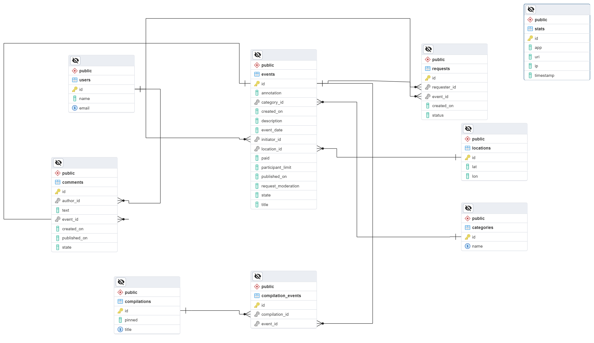

# ExploreWithMe

ExploreWithMe - приложение для обмена информацией об интересных событиях и поиска компании для участия в них. Оно упрощает планирование свободного времени, предоставляя пользователям возможность делиться и находить события различных категорий.

## Описание проекта

ExploreWithMe предоставляет два основных сервиса: основной сервис, содержащий все необходимое для работы приложения, и сервис статистики, собирающий информацию о количестве просмотров и анализирующий работу приложения.

### Основные функции

- **Публичный API**: Позволяет пользователям искать и фильтровать события, просматривать краткую информацию и получать подробную информацию о конкретных событиях.
- **Закрытый API для авторизованных пользователей**: Предоставляет возможности добавления и редактирования мероприятий, подачи заявок на участие, и управления событиями.
- **Административный API**: Предоставляет возможности для администраторов настройки и поддержки работы сервиса, включая управление категориями, подборками, модерацию событий и управление пользователями.

## Технологический стек

- Java, Spring Boot, Spring Data JPA, Spring MVC, Hibernate, Docker, PostgreSQL.

## Настройка и развертывание

### Системные требования

- Java 11
- Docker
- PostgreSQL

### Инструкция по развёртыванию

1. Склонируйте репозиторий: `git clone https://github.com/EugeneP87/java-explore-with-me.git`
2. Запустите PostgreSQL с использованием Docker.
3. Настройте базу данных в соответствии с `schema.sql`.
4. Запустите основной сервис и сервис статистики.
5. Проверьте работу приложения, обратившись к соответствующим эндпойнтам.

## Дополнительная информация

- **Структура проекта**: Разделен на модули, включая основной сервис и сервис статистики.
- **Тестирование**: Реализованы Postman-тесты.
- **Swagger-спецификации API**: Доступны в файлах `ewm-main-service-spec.json` и `ewm-stats-service.json`.

## Диаграмма базы данных

На диаграмме представлена структура базы данных для основного сервиса ExploreWithMe. Сущности включают в себя информацию о событиях, пользователях, запросах на модерацию, комментариях и других важных аспектах приложения.

